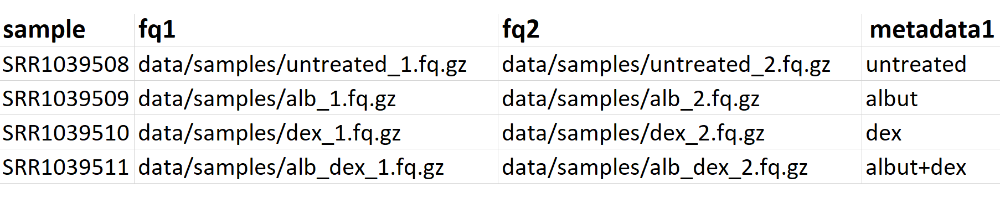

<h1>Orpheus</h1>
Orpheus (Omicsoft-inspired RNA-seq pipeline) is a workflow that performs 
quality control, alignment, expression quantification and variant calling on 
RNA-seq data based on  [GATK Best Practices](https://gatk.broadinstitute.org/hc/en-us/articles/360035531192-RNAseq-short-variant-discovery-SNPs-Indels-).
It was written with the Python-based workflow manager
[Snakemake](https://snakemake.readthedocs.io/en/stable/).

<h2>Usage</h2>
<h3>Step 0: Install Snakemake</h3>
The recommended way to install Snakemake is with
[Conda](https://snakemake.readthedocs.io/en/stable/getting_started/installation.html#installation-via-conda).
This method yields your own Conda environment where Snakemake is run, and
where all software dependencies are installed and managed.

One caveat is that Conda is not installed system-wide on HPC at the time of 
writing. Therefore, the easiest way to start working with Orpheus is to use the 
Docker method described in</b> [Step 3](#step-3-execute-workflow),  which comes 
installed with Snakemake and associated dependencies.

<h3>Step 1: Get Orpheus</h3>
[Clone](https://help.github.com/en/github/creating-cloning-and-archiving-repositories/cloning-a-repository)
the repo to your path of choice on HPC or a local machine:

```
git clone https://git.agios.local/Jeff.Alvarez/orpheus.git
```
<h3>Step 2: Configure Orpheus</h3>
Analysis names and reference data are specified with a config file. The layout 
is based on the config file used for the 
[Array Studio RNA-seq pipeline](https://git.agios.local/Mark.Fletcher/array_studio_RNAseq_pipeline).
The example shown below is based on the config file 
<code>workflow/config/config.test.yaml</code>, which was made to run the test
data:

```
ID: 20XX_11_11_test
Title: "YYYY-MM-DD Test"
HPC_ID: jane.doe
Contact_name: "Jane Doe"
Organism: "Human"
samples: /path/to/sample_sheet.tsv
ref:
        fa: /path/to/Human_B37.3.fasta
        gtf: /path/to/Human_B37.3.gtf
        build: Human_B37.3
        known_sites: /path/to/dbsnp_138.b37.vcf.gz
```
The config file takes the following values:
* <b>ID</b>: Filename of output directory where analysis files are written.
* <b>Title</b>: String character for analysis ID.
* <b>HPC_ID</b>: User ID on HPC.
* <b>Contact_name</b>: String character of HPC ID.
* <b>samples</b>: Absolute path to sample sheet with input fastqs and metadata.
* <b>ref</b>: Reference data to be used in alignment and variant calling.
     - <b>fa</b>: Absolute path to fasta file (.fasta).
     - <b>gtf</b>: Absolute path to gene annotation file (.gtf).
     - <b>build</b>: Name of reference genome--output files will use this prefix.
     - <b>known_sites</b>: Absolute path to known variants file (.vcf.gz).

<h3>Step 3: Create sample sheet</h3>
Input fastqs and metadata are specified with a sample sheet. Each entry of the
sample sheet describes a unique sample ID, paths to corresponding fastq paths,
and metadata columns describing the experimental setup of the analysis. An 
example <code>data/sample_sheet.tsv</code> is included with Orpheus for analyses
run with the test dataset in the same directory. An empty template to write
in your own data is available at <code>data/template.tsv</code>. Alternatively,
you may create your own sample sheet in Microsoft Excel as long as the columns
are labeled exactly as shown below and the file is saved as "Text (Tab
delimited) (*.txt)"



<h3>Step 4: Execute workflow</h3>
<h4>Docker</h4>
The workflow may also be deployed as a Docker image, where a conda environment
is set up with Snakemake and dependencies installed. When run, the conda
environment is activated then the Snakemake directory, input FASTQ files,
and reference data are mounted as <code>analysis</code>, <code>input</code>, and <code>ref</code> respectively:

```
docker run -it --rm \
    --user "$(id -u):$(id -g)" \
    -v /data/exploratory/Users/jeff.alvarez/orpheus:/home/user/analysis \
    -v /data/exploratory/Users/jeff.alvarez/orpheus/data/samples/single:/home/user/input \
    -v /data/exploratory/Users/jeff.alvarez/orpheus/data:/home/user/ref \
    jeff.alvarez/orpheus:latest /bin/bash -c \
    "conda run -n snakemake \
    snakemake -j 8 --keep-remote --use-conda \
    --directory /home/user/analysis \
    --configfile /home/user/analysis/config/config.docker.yaml \
    -s /home/user/analysis/Snakefile"
```

<h4>Local</h4>
Test your configuration by performing a dry-run:

```
snakemake --use-conda -np
```

Execute the workflow locally using <code>$N</code> cores:

```
snakemake --use-conda --cluster --cores $N
```
