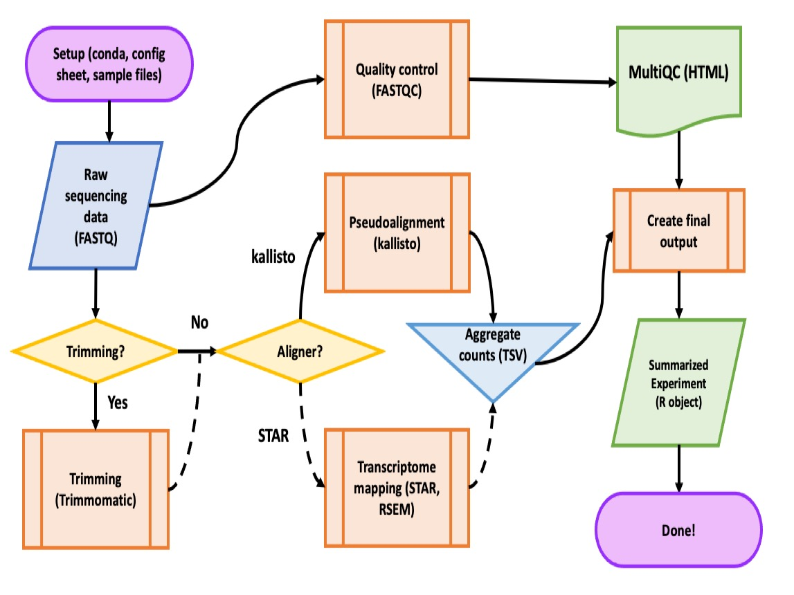

<h1>Orpheus</h1>

Orpheus is a Snakemake workflow that performs quality control, alignment, and
quantification of raw sequencing data. The learning curve in bioinformatics
pipeline development, coupled with the large size of input datasets and limited
computational resources to execute the pipeline, have been an ongoing challenge
to the Data Science team. One solution is a modular, scalable pipeline designed
with the simplest suite of tools for analytically sound, robust deliverables.
Efficiency made possible by parallel processing of jobs and selection of
bioinformatics software that performs tasks without sacrificing experimental
validity.
