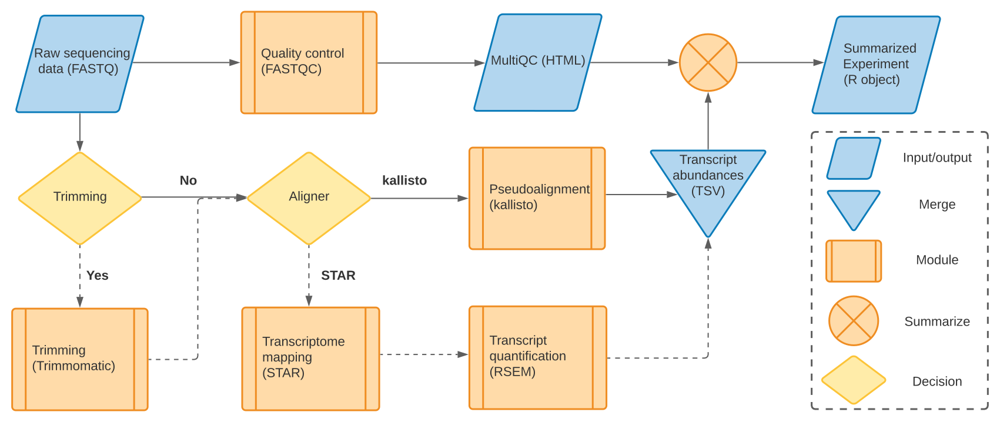

<h1>Orpheus RNA-seq pipeline</h1>

**orpheus** is an RNA-seq pipeline that performs quality control, alignment, and 
quantification on raw sequencing data. Processing big data with limited 
computational resources presents a challenge to time-sensitive exploratory
data science. The Data Science team has developed a modular, scalable pipeline 
that employs a suite of bioinformatic tasks into a concise workflow that 
processes several samples at once while being efficient in both runtime and
computational resource. The result is a standardized data output that is 
analysis-ready and easily communicated to other team members and departments. 
The "Getting started" guide provides a hands-on approach to becoming familiar 
with Orpheus and opening curiosity for how it may provide useful in exploratory 
efforts.

In-depth explanation of the workflow steps, file structure, benchmarking, 
rationale for software and techniques chosen, and other information 
may be found on the Orpheus entry at the 
[Data Science DokuWiki](https://hpc.agios.local/dokuwiki/doku.php?id=orpheus_rna-seq_pipeline).